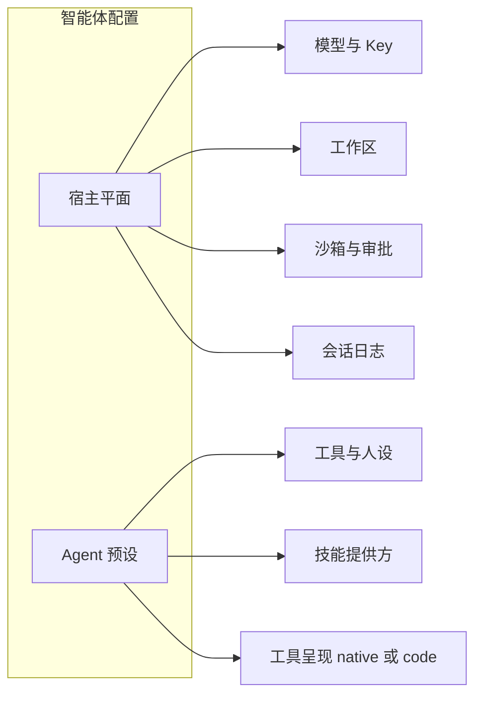
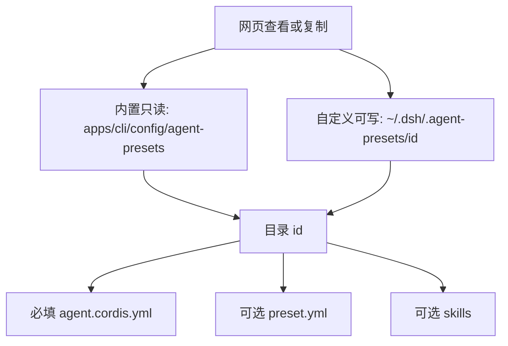

# 课 06 · Agent 预设是什么，四种模式差在哪

> [!abstract] 一句话
> 预设是「这个会话的 Agent 装了哪些插件」，不是智能体的全部配置；PTC 表示用一段代码组合多轮工具调用。

> [!question] 这一课要解决的问题
> 作为已经能打开本机网页、进到「设置 → Agent 预设」的学习者：先用官方源码和官方文档说清「预设」是什么、是不是智能体的全部配置；四种内置模式各自改了什么；PTC 官方怎么说、三个字母仓内有没有展开；自定义预设存在哪、按什么格式存、内置四份到哪看。学完能用自己的话复述，能指出「在预设里 / 不在预设里」各举两例，并能打开内置 yml 和本机用户根。当前不写官方 `docs/`，不把命令行当主线，不改装核心循环。

上一课：[[20260820-09-教程_05-设置页为什么录不了API-Key|课 05 录不了 Key]]（[md](./20260820-09-教程_05-设置页为什么录不了API-Key.md)） · 下一课：[[20260820-11-教程_07-插件是什么与怎么写|课 07 插件]]（[md](./20260820-11-教程_07-插件是什么与怎么写.md)） · 回 [[00-README|课程表]]

本课只讲**设置里这一屏**。填 Key、选工作区仍看课 04。

---

## 图景

设置左侧「通用设置 / 模型 / 插件 / Agent 预设」是四个分区，不是同一张表的四个标签。

**Agent 预设** 管的是：你 **下一个会话** 里的智能体，到底装了哪些插件——因而有哪些工具、哪几段提示词、哪一层技能。界面第一句已经写死：

> 预设即一个会话的 Agent 所运行的插件组装 —— 它的工具、提示词与能力。

四个卡片不是四个「人设文案」。目录名分别是 `standard`、`code`、`minimal`、`cordis`；中文名「标准 / PTC / 极简 / 创造」是展示层。官方产品页仍把第二张叫 **Code mode**；网页中文把它写成 **PTC 模式**。

自定义预设不是再选一张内置卡，而是把某一份组装**整目录复制**到本机用户根下，再改副本。

**预设不是智能体的全部配置。** 它是「这个会话的 **Agent 平面**」：工具、人设、提示词段、压缩策略、以及这个预设带上的技能提供方。模型 Key、工作区、沙箱、审批、会话日志、宿主插件树，都不在这份目录里。



这张图要记住：预设只占右边；左边那些换预设也带不走。

---

## 整理后的问题（对话里先说这一句）

先分清「预设 = 一份会话级组装，不是全部配置」；再对照四份官方 yml；再钉死 PTC 的官方说法与落盘位置。

---

## 步骤

### 1. 在界面上对上三件事

打开网页 → **设置 → Agent 预设**。先只看，不急着点「设为默认」。

| 你看见的 | 它实际指什么 |
|----------|----------------|
| 卡片中文名（标准模式…） | 展示名，来自 `preset.yml` + 界面词典 |
| 卡片左下角 `standard` / `code` / `minimal` / `cordis` | **预设 id**，等于目录名，会话日志记这个 |
| 「内置」 | `trust: system`，部署随附，网页不能删 |
| 「当前使用」 | 这个设置对话框所属会话**已经挂上**的预设；开始后不能换 |
| 「设为默认」 | 只影响**此后新建**的会话（`agent-presets.default`） |
| 「查看」 | 读这份 `agent.cordis.yml` 原文 |
| 「复制」 | 整目录复制成自定义预设 |
| 「用创造模式创作」 | 暂存选中 `cordis`，关掉设置，开一个创造模式会话让 Agent 帮你写 |

设置对话框右上角「打开配置文件」打开的仍是 `~\.dsh\settings.yaml`（外观、默认预设 id、权限默认等）。**不是**四份内置组装文件。内置文件在本仓 `apps/cli/config/agent-presets/<id>/`。

### 2. 用官方一句话钉死定义

包说明（[`packages/preset/README.zh.md`](../../../packages/preset/README.zh.md)）：

> **agent preset** 是一个目录，其中放置一份 `agent.cordis.yml`。把它挂上某个会话的 Agent，这个会话就得到自己的工具与提示词段落；别的正在跑的会话不受影响。

架构表（[`docs/architecture.zh.md`](../../../docs/architecture.zh.md)）：

> 让某个会话拥有不同的能力集合 → 组装一个 agent preset。

官方用户指南（[`docs/user/guide/index.zh.md`](../../../docs/user/guide/index.zh.md)）**没有**这一屏的专章。产品站 [deepseek.com/harness](https://deepseek.com/harness/en/) 用「Multiple runtime modes」讲同一套四模式，英文仍写 Standard / Code / Minimal / Creator。

所以：仓内机制名是 **agent preset**；产品口语是 **运行时模式**；网页分区标题是 **Agent 预设**。三套叫法指向同一份目录。

### 3. 预设是不是智能体的全部配置

**不是。** 日常说的「智能体配置」比预设大一圈。官方把世界切成两平面（[按会话组装](../../../.agents/notes/implemented/architecture/2026-08-03-per-session-agent-presets.md)）：

| 在预设目录里（Agent 平面） | 不在预设里（宿主 / 别的设置） |
|----------------------------|--------------------------------|
| 这个会话有哪些**工具插件**（bash、读文件、网页检索…） | **模型**和 API Key（设置 → 模型） |
| **人设** `persona`、工作区指令 `agent-instructions` | **工作区**选哪一个文件夹 |
| 技能提供方、计划 / 目标 / 子代理 / 工作流等**贡献行** | **沙箱 + 审批**（权限预设） |
| 工具怎么呈现给模型（`native` 还是 Code Mode） | **会话日志**、持久化、标题 |
| 可选的随附 `skills/`、展示用 `preset.yml` | 宿主 **插件树**（设置 → 插件）、语言外观 |

`standard` 的组装文件头写明：宿主组合（`base.cordis.yml` + `web.cordis.yml`）留下预设**不准拥有**的东西——注册表本体、沙箱与审批栈、持久化、**模型路由**。Agent Note 同一句：模型路由已经有按 Agent 的接缝，LLM 适配器放进预设也到不了 `agent-loop`。

用产品话说：预设决定「这个会话的 Agent **会什么、怎么叫工具**」；不决定「用哪把钥匙、改哪个文件夹、出事前问不问你」。

四张卡仍然不是四套提示词。提示词只是组装里的一行（`persona`，有时还有 `agent-instructions`）。差的是**整份插件列表**，以及模型**怎样看见工具**。

### 4. 四种模式文件里差在哪

对照本仓随附文件（权威清单就是这四个目录，包 README 禁止再手抄一份名单）：

| 内部 id | 界面中文 | 产品页英文 | 和「标准」比，文件里多了/少了什么 |
|---------|----------|------------|-------------------------------------|
| `standard` | 标准模式 | Standard mode | 完整编码 Agent：文件、Shell、检索、Skills、计划、目标、子代理、工作流… |
| `code` | PTC 模式 | Code mode | **几乎整份标准**，再多一行 `tool-presentation`，`mode: code` |
| `minimal` | 极简模式 | Minimal mode | **另一份组装**：固定短提示词 + 持久 shell + `str_replace_editor`；没有 Skills / 网页 / 计划 / 子代理 |
| `cordis` | 创造模式 | Creator mode | **几乎整份标准**，再多 `tool-cordis`、两份随附 Skill，以及一段「两平面」人设 |

`code` 文件头自己写：标准里的东西原样保留；多出来的是呈现方式——模型不再一次调一个工具，而是写一段 TypeScript，由 `run_code` 执行。

`cordis` 文件头自己写：存在的理由是「让人请 Agent 再写一个 Agent」；`cordis_mount` 会在**活着的运行时**上执行模型写的 JavaScript，信任级别按 **和 Shell 同级** 对待。

`minimal` 文件头自己写：人设就是**完整**系统提示（`complete: true`），后面的插件不能再往提示词里加字；给评测/极简环境，不是给日常写代码。

### 5. 技能一样吗

**不完全一样。** 分三层看，不要混成一句「技能全局共享」。

1. **有没有技能工具。** `standard` / `code` / `cordis` 都挂了 `skill-filesystem` + `tool-skill`。`minimal` **没有**这两行，模型没有技能目录和加载器。
2. **默认会扫到哪。** 挂了 `skill-filesystem` 且未关掉默认根时，会扫项目里的 `.dsh/skills`、用户 `~/.dsh/skills`、以及 `~/.agents` 等兼容根（见 [`packages/skill/skill-filesystem/README.zh.md`](../../../packages/skill/skill-filesystem/README.zh.md)）。所以三种「完整」预设，**你自己放在用户/项目根下的技能，原则上都能看见**。
3. **创造模式额外自带两份。** `cordis` 用 `customSkillDirs` 指向预设目录里的 `skills/`：`editing-cordis-compositions`（怎么改组装）、`cordis-plugin-development`（怎么做动态插件）。这两份跟着创造模式走，不跟着极简走。

技能注册表在**宿主**里，但是按 scope 分层：预设挂上去的提供方进这一层。换预设等于换这一层的贡献，不是换一个全局单例名单。

### 6. 和其他设定一样吗

**不一样。** 同一个设置窗里的邻居，各管一层。

| 左侧分区 | 管什么 | 改了之后 |
|----------|--------|----------|
| 通用设置 | 语言、外观、默认 Agent 预设、默认**权限**预设 | 默认值给**新会话**；已开会话不回头 |
| 模型 | 提供方、API Key、选哪个模型 | 模型路由在**宿主平面**；预设文件不准装 LLM 适配器 |
| 插件 | 本进程已经装上的宿主插件（配置 / 列表） | 整棵 Host Loader 树，不是某一个会话的 Agent |
| Agent 预设 | 该会话 Agent 的插件组装 | 空白会话可切；一旦产出内容就锁死 |

还有一个容易撞名的词：**权限预设**（界面在通用设置里）。它只捆绑「沙箱模式 + 审批策略」（`workspace-write` / `danger-full-access`），见 [`packages/interaction/permission-presets/README.zh.md`](../../../packages/interaction/permission-presets/README.zh.md)。它不决定你有没有 `tool-web`，也不决定是不是 Code Mode。

Agent Note（[按会话组装](../../../.agents/notes/implemented/architecture/2026-08-03-per-session-agent-presets.md)）把世界切成两平面：

- **宿主**：注册表本体、持久化、沙箱与审批、模型路由、跨会话设施。一份进程一份。
- **Agent 预设**：单个会话往那些注册表里**贡献**的工具、人设、提示词段、压缩策略。一份会话一份。

所以：换模型 ≠ 换预设；关某个宿主插件 ≠ 换预设；把审批改成「不要问」≠ 换预设。

### 7. 为什么叫这些名字；PTC 是什么、代表什么

**标准 / Standard。** 部署默认的完整编码 Agent。id 用日常词 `standard`。

**极简 / Minimal。** 只留持久 bash（Windows 上是 pwsh）和 `str_replace_editor`。产品文案写它用于**评测模型**时尽量少帮模型。

**创造 / Creator，id 却是 `cordis`。** Cordis 是本仓的插件内核。目录名跟内核走；给人看的名字跟任务走（帮你创造下一个预设）。

**PTC 代表什么（分层说，不要揉成一句）。**

1. **官方中文产品页怎么说。** [deepseek.com/harness/zh](https://deepseek.com/harness/zh/)：「PTC 模式通过模型生成的一段代码组合多轮工具调用。」同一页卡片仍写「通过 **Code Mode SDK** 呈现工具」。官方用 PTC 当**产品名**，用 Code Mode 当**技术名**。产品页**没有**把 PTC 三个字母写成英文全称。
2. **官方源码怎么说。** 目录和机制一直叫 `code`。`apps/cli/config/agent-presets/code/agent.cordis.yml` 第一句仍是 “presented as Code Mode”。工具注册表的呈现模式是 `native` / `code` / `both`（[`packages/core/tools/README.zh.md`](../../../packages/core/tools/README.zh.md)）。界面词典把展示名写成「PTC 模式 / PTC mode」（[`locales.ts`](../../../packages/client/ui-agent-preset/src/client/locales.ts)）。**仓库里搜不到 PTC 的英文展开。**
3. **为什么不继续叫 Code mode。** 「Code mode」容易听成「专门写代码的模式」。它其实是**换一种叫工具的方式**，能力和标准模式同一套。叠加层调查记过：培训口播要把展示名改口成 PTC，机制仍是 Code Mode。
4. **社区怎么展开（不当仓内符号）。** 中文报道（如 36 氪、技术博客）常把 PTC 写成 **Programmatic Tool Calling / 程序化工具调用**。这和官方那句「用一段代码组合多轮工具调用」同方向，但源码和产品页都没有把这三个字母钉死成这句英文。

记住对应：`id = code` → 机制 = Code Mode（`run_code` + 生成的 TypeScript SDK）→ 卡片 = PTC 模式 → 含义 = 模型先写程序，再由程序组织多步工具。

### 8. 预设存在哪、按什么格式存、内置到哪看

**先看内置（只读，不要改）。**

| 怎么看 | 路径 |
|--------|------|
| 网页 | 设置 → Agent 预设 → 某张卡的 **查看**（读出 `agent.cordis.yml` 原文） |
| 本仓库源码 | [`apps/cli/config/agent-presets/`](../../../apps/cli/config/agent-presets) 下四个子目录：`standard`、`code`、`minimal`、`cordis` |
| 跑起来的进程 | 启动器把随附根钉成应用配置旁边的 `config/agent-presets/`（`apps/cli/src/profile-boot.ts` 的 `SHIPPED_PRESET_ROOT`）。源码布局和构建后的 `apps/cli` 布局都是这一份。 |

四个子目录就是官方说的「部署交付哪些预设，看这份目录列表」。包 README 禁止再手抄一份名单。

**你新增的自定义预设写在哪。**

默认用户根：`${DSH_HOME:-~/.dsh}/.agent-presets/<id>/`。本机 Windows 通常是 `C:\Users\<你>\.dsh\.agent-presets\`。设了环境变量 `DSH_HOME` 就跟那个走。网页复制成功后可用 **打开目录 / 查看路径**；创造模式的 Skill 也写同一句话。

「设为默认」只改 `~\.dsh\settings.yaml` 里的命名空间，**不**把组装文件写进去：

```yaml
agent-presets:
  default: my-agent
```

**格式：一个预设 = 一个目录，不是单个散文件。**

```text
<id>/                          # 目录名 = 预设 id，只能 [a-z0-9][a-z0-9-]*
  agent.cordis.yml             # 必填。顶层是插件行列表（- id / name / config）
  preset.yml                   # 可选。只放展示：name、description；内置还有 order
  skills/                      # 可选。创造模式自带；复制时整目录一起走
```

`agent.cordis.yml` 必须是「具名插件行组成的列表」。YAML 不能在这份列表旁边再塞同级键，所以展示文案单独放 `preset.yml`。`preset.yml` **不能**写 `id` 或 `trust`，否则自定义预设就能冒充内置。

`preset.yml` 样子（内置标准）：

```yaml
name: 标准模式
description: 功能完整的编码 Agent，支持文件编辑、Shell、文件与网页检索、Skills、计划、目标、子代理和工作流。
order: 1
```

复制时会整目录拷贝（组装、元数据、skill、附件；符号链接解成实体文件），然后重写 `preset.yml`：保留来源的描述，**丢掉**来源的名称和 `order`，换上你填的显示名。官方包说明：`copy()` 是唯一创作写入，调用方不提交组装正文。

不要改 `apps/cli/config/agent-presets/` 里的内置目录。升级会盖掉；弄坏 `cordis` 等于弄坏创作入口。



这张图要记住：内置和自定义都是**目录**；默认 id 写在 `settings.yaml`，不是组装文件本身。

### 9. 自定义预设意味着什么（产品 / 应用 / 代码）

**产品。** 你拥有一份本机私有的 Agent 配方。内置四份升级会被覆盖；副本不会自动跟着官方 `standard` 长新工具。官方包说明写明：`copy()` 是**唯一**创作写入，调用方从不提交组装正文，因此复制不会凭空获得源预设没有的能力。创造模式按钮：把即将开始的会话**暂存**到 `cordis`，你用自然语言描述想要的 Agent，由那个会话去 `copy` 再改文件。

**应用。** 副本落在第一个 `user` 根：默认 `${DSH_HOME:-~/.dsh}/.agent-presets/<id>/`，里面至少有 `agent.cordis.yml`，常有 `preset.yml`，创造模式还会带上 `skills/`。id 必须是 `[a-z0-9][a-z0-9-]*`，事后不能改（它就是目录名）。内置不能删；自定义能删。已经跑在旧预设上的会话继续用旧挂载；新会话才能选新 id。空白会话可以 `recompose`；说过一轮话就返回 `agent-preset-locked`。

**代码。** `ctx.agentPresets.copy(from, id, name?)` 整目录复制（解引用符号链接，权限收紧）。挂载发生在 Agent 工厂的 `setup`：把这份 yml 当成 Cordis 子树插进该 Agent 的 scope，认父链是 `agent → preset → global`。包名（`@deepseek-ai/dsh-*`）从**宿主**解析，相对路径从**预设目录**解析——所以你才能在家目录里写预设，而不必自带一份 `node_modules`。`user` 预设的权限等于它引用的插件；`trust` 字段给界面打「自定义」徽章，**不是**沙箱隔离。

自己动手的最小路径（网页）：

1. 在某一张内置卡上点 **复制**。
2. 标识符填 `my-agent` 这种合法 id，名称随便。
3. 创建成功后用 **打开目录 / 查看路径**，改副本里的 `agent.cordis.yml` 和 `preset.yml`。
4. **新开一个会话**（或空白会话）再选 `my-agent`。正在聊的窗口不会悄悄换装。

或者点 **用「创造模式」创作自定义预设**，在新会话里用中文描述目标，让 Agent 走同一条 `copy` 接缝。不要去改 `apps/cli/config/agent-presets/` 里的内置目录——升级会盖掉，弄坏 `cordis` 等于弄坏创作入口。创造模式自己的 Skill 把这一点写成红线。

### 10. 你带别人时先让对方做到哪一步

先让对方说清：预设不是全部配置。再指着四张卡说出内部 id。打开「查看 · 标准模式」看见插件行。能在资源管理器里指到本仓 `apps/cli/config/agent-presets/`，并说出自定义落在 `~\.dsh\.agent-presets\`，这一课就算带到了。

---

## 边界

- 四种模式**共享**宿主上的模型 Key、工作区、沙箱与审批栈；换预设不会换 API Key。
- 换默认预设**不会**改已经在跑的会话。界面副文案：「对此后新建的会话生效。」
- 创造模式能改活运行时，按官方文件头视为 **Shell 级信任**。不要把它设成「随手默认」再交给不信任的任务。
- 副本是快照：官方给 `standard` 加新工具，你的 `my-agent` 不会自动长出来。
- 发现阶段只检查 YAML 能不能解析；引用了不存在的包，要等真正开会话才失败。
- 本课不教改 `agent-loop`，不教合上游。要改装某一行，下一场是 `S-eng-change`，先归档再动 L2。

---

## 验收

- [ ] 能用自己的话说：预设 = 一份挂到单会话上的组装目录，**不是**智能体的全部配置。
- [ ] 能各举两例：在预设里的（工具、人设） / 不在预设里的（Key、工作区、权限、会话日志）。
- [ ] 能指出四张卡的内部 id；能说 PTC = 官方产品名，含义是用一段代码组合多轮工具调用，机制仍是 `code` / Code Mode；仓内不展开三个字母。
- [ ] 能否定「只是提示词不同」：至少举出 `tool-presentation`、`minimal` 少工具、`cordis` 多 `tool-cordis` 之一。
- [ ] 能打开内置目录 `apps/cli/config/agent-presets/`，并说出自定义在 `~\.dsh\.agent-presets\<id>\`，格式是目录 + `agent.cordis.yml`（必填）+ `preset.yml`（展示）。
- [ ] 知道「设为默认」只写 `settings.yaml` 的 id，不移动组装文件；新开会话才用上新预设。

---

## 下一步

自己在界面上对照「查看」原文 → 仍是本场收口（`S-learn-ask` 的最小对照）。

真的要复制一份改工具 → `S-eng-change`（叠加层，先归档）。

想讲给同事勾同一张验收 → `S-train-lead`。

想搞清「插件」本身怎么定义、怎么插、怎么写 → [[20260820-11-教程_07-插件是什么与怎么写|课 07]]（`S-eng-deep`）。

---

## 相关与参考

### 内部（本学堂 · 双链）

- 相近主题：[[20260820-11-教程_07-插件是什么与怎么写|课 07 宿主插件是什么]]（[md](./20260820-11-教程_07-插件是什么与怎么写.md)）
- 相近主题：[[20260820-09-教程_05-设置页为什么录不了API-Key|课 05 设置分区与配置文件]]（[md](./20260820-09-教程_05-设置页为什么录不了API-Key.md)）
- 相近主题：[[20260820-06-教程_04-网页用户旅程与API-Key|课 04 填 Key 与用户红线]]（[md](./20260820-06-教程_04-网页用户旅程与API-Key.md)）
- 平行展开：[[20260820-07-问答_提问与答案|本主题问答]]（[md](./20260820-07-问答_提问与答案.md)）
- 课程表：[[00-README]]（[md](./00-README.md)）

### 外部（官方与仓内文档）

- [产品站中文：PTC 模式用一段代码组合多轮工具调用](https://deepseek.com/harness/zh/)
- [产品站英文：四种 runtime modes（卡片仍写 Code mode）](https://deepseek.com/harness/en/)
- [包说明：按会话组装 agent](../../../packages/preset/README.zh.md)
- [包说明：agent-presets 服务与创作规则](../../../packages/preset/agent-presets/README.zh.md)
- [随附四份预设目录](../../../apps/cli/config/agent-presets)
- [工具呈现：native / code / both](../../../packages/core/agent-tool-presentation/README.zh.md)
- [Code Mode 在工具注册表里怎么呈现](../../../packages/core/tools/README.zh.md)
- [决策记录：为什么是预设而不是新 Loader 层](../../../.agents/notes/implemented/architecture/2026-08-03-per-session-agent-presets.md)
- [权限预设（不要和 Agent 预设撞名）](../../../packages/interaction/permission-presets/README.zh.md)
- [官方 Web 使用指南（尚未写预设专章）](../../../docs/user/guide/index.zh.md)

## 附录 · 原始输入

按时间从旧到新。除标点空格外不改写。

### 2026-08-20 · 首问

> 接下来请你帮我理解一下这个界面上面的概念，我想了解一下 这里面的智能体预设是怎么回事？它有4种模式，4种模式有什么不同？他是不是就是提示词的不一样，他的技能一样吗？他和其他的设定一样吗？它为什么叫这几个名字？Ptc是什么意思？然后请你帮我充分调查研究了之后，写一个教程告诉我，你优先关注官方的源代码，以及官方的文档，看他是怎么说的。然后如果我创造自定义预设，又意味着什么？你从代码层面，从应用层面，从产品层面帮我充分的解读一下，形成教程。

### 2026-08-20 · 追问 1

> 我想了解一下，预设是不是就是我们所说的一个智能体的所有配置？这个帮我理解一下，然后更新上去，另外呢，它为什么叫ptc呢？Ptc是什么意思？代表什么含义？还有就是如果我要设置增加预设，这些预设是存在哪里的？按照什么样的格式存的，他原本给我们的这些预设，我可以才从哪里去看呢？这些信息也帮我收集起来，整合到刚才的那份教程里。
