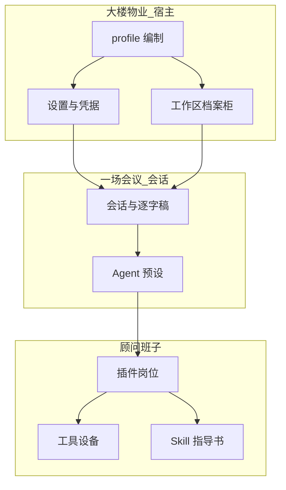
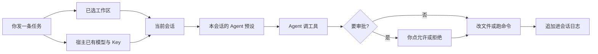

# 课 10 · 核心概念清单：先认层，再选优先词

> [!abstract] 一句话
> 「配置 / 预设 / 插件」不是设置里四个并列标签，而是宿主编制、一场会议、一个岗位三层东西。

> [!question] 这一课要解决的问题
> 作为已经能打开本机网页、走过课 01→03→04（可选 05/06/07）的学习者与开发者：从本仓库事实出发，整理配置、预设、插件、Skill、profile、工作区、会话等核心概念清单；标明初学者与开发者各自优先关注哪些、时间有限时先学哪一层。学完能用自己的话复述三层、指出「不在预设里」的两例，并能按优先级选下一课。用办公场景里可推敲的比喻说明关系，可附图。当前不把命令行当主线，不写官方 `docs/`，不改装核心循环。

上一课：[[20260820-11-教程_07-插件是什么与怎么写|课 07 插件]]（[md](./20260820-11-教程_07-插件是什么与怎么写.md)） · 下一课按角色：[[20260820-10-教程_06-Agent预设与四种模式|课 06 预设]] 或 [[20260820-12-教程_08-网页Session-log怎么下怎么读|课 08 日志]] · 回 [[00-README|课程表]]

本课是**地图**。四张预设卡的细则仍看课 06；怎么写插件仍看课 07。

---

## 图景

你在设置里会同时看见「通用设置 / 模型 / 插件 / Agent 预设」，口语里又常把它们都叫「配置」。这四个分区**不是同一张表的四个标签**。

用一场可核对的办公场景来钉死层次，不要把比喻当成第二套产品名：

一家公司要办一个项目。大楼物业管门禁、档案室和用印台；某一场工作会议请来一套顾问编制；顾问班子里每个岗位有任命书。钥匙不进会议纪要。没指定档案柜，会上就不能改文件。

仓内对应关系（官方词在前，比喻只作助记）：

| 仓内词 | 办公对应 | 这一层管什么 |
|--------|----------|----------------|
| **宿主 / profile 树** | 大楼物业与这家分公司的编制 | 一份进程一份：模型路由、凭据、沙箱审批、持久化、网页壳 |
| **会话 + Agent 预设** | 一场带纪要的会 + 这场会的顾问编制 | 一份会话一份：工具、人设、技能提供方 |
| **插件 + 配置行** | 岗位 + 任命书 | 模块导出入口，yml 里一行把它挂上 |
| **Skill** | 作业指导书（SOP） | 给模型读的工作流说明，不是 Cordis 岗位合同 |

这张图要记住：**上面换编制，下面换顾问班子；钥匙和工作区不跟着预设走。**

---

## 整理后的问题（对话里先说这一句）

先认三层，再对清单勾「初学 / 开发 / 限时」，再用同一套办公比喻把词钉死，最后按优先级选下一课。

---

## 步骤

### 1. 先认三层，再读任何「配置」

口语「配置」在本仓至少指四件不同的东西。先对号，再打开文件。

| 你听见的「配置」 | 实际对象 | 典型落点 |
|------------------|----------|----------|
| 网页里改语言、默认预设、外观 | **用户设置** | `~\.dsh\settings.yaml`（设置右上角「打开配置文件」） |
| 填 API Key | **凭据** | `~\.dsh\.credentials.yaml`，不进对话、不进 Git |
| 启动时整棵能力树 | **profile 叠加的 Cordis 树** | 组合包 → profile patch → home patch |
| 这个会话会什么 | **Agent 预设** | 内置 `apps/cli/config/agent-presets/<id>/`；自定义 `~\.dsh\.agent-presets\<id>\` |

课 06 的结论在这里复用一句：**预设不是智能体的全部配置。** 模型 Key、工作区、沙箱与审批、会话日志、宿主插件树，都不在预设目录里。

### 2. 概念清单：谁该先盯哪几个

**P0** = 限时也必须会指认；**P1** = 会用网页后立刻补；**P2** = 要改装或复盘再学；**暂缓** = 本课不展开命令行细节。

| 概念 | 一句话（仓内） | 初学者 | 开发者 | 限时 |
|------|----------------|--------|--------|------|
| 工作区 | Agent 被允许改的那一个项目目录；未选中则输入框不可用 | P0 | P0 | **先** |
| API Key / 凭据 | 模型提供方的密钥，落在凭据文件，设置 → 模型 | P0 | P0 | **先** |
| 会话 | 一次带 id 的对话生命周期 | P0 | P0 | **先** |
| Agent | 这场会话里接任务、调工具的执行者 | P0 | P0 | **先** |
| 审批 / 沙箱 | 危险动作先问你；沙箱限制能碰哪 | P0 | P1 | **先** |
| Agent 预设 | 该会话 Agent 的插件组装（工具、提示词、能力） | P1 | P1 | 会选四张卡即可 |
| 权限预设 | 只捆绑沙箱模式 + 审批策略，不是顾问编制 | P1 | P1 | 和「预设」拆开 |
| 用户设置 | 语言、外观、**新会话**的默认值 | P1 | P1 | 扫一眼 |
| 插件 | 能被 Loader 挂上的 Cordis 模块 | 暂缓细节 | P0 | 开发者先认「模块+一行」 |
| 配置行 | `cordis.yml` 里 `id` + `name` + 可选 `config` | 暂缓 | P0 | 与源码拆开 |
| 组合包 bundle | 一批配置行 + 要挂的代码，可被上层 patch | 暂缓 | P1 | 改装前 |
| profile | `~\.dsh\profiles\<名>\` 的具名宿主组装 | 暂缓 | P1 | 改装前 |
| patch | 按 id **整份替换**某条 config，或插入新行 | 暂缓 | P1 | 叠加层常用 |
| Skill | `SKILL.md` 工作流，技能工具扫目录，不是插件 | 知道「说明书」 | P0 | 和插件拆开 |
| 工具 | 模型可调用的具名操作 | P1 | P0 | 看见卡片即可 |
| 会话日志 | 只追加的 jsonl 事实流 | 专题 | P1 | 要复盘再看课 08 |
| 模型 / 提供方 | 宿主上的路由；预设不准装 LLM 适配器 | P0 会填 | P1 | Key 会填即可 |
| 宿主平面 | 注册表、持久化、沙箱审批、模型路由；一份进程一份 | 听过 | P0 | 开发者地图核心 |
| Agent 平面 | 单会话往注册表**贡献**的工具与人设 | 听过 | P0 | 开发者地图核心 |

> [!tip] 限时只带三句话出门
> 初学者：选工作区、填 Key、发一条只读任务。开发者：先分清宿主 / 会话预设 / 插件行，再决定改哪一层。两边都先记住：**换预设带不走钥匙和档案柜。**

### 3. 概念解释（办公比喻 + 仓内锚点）

比喻只用来建立关系。验收时仍用左边的官方词。

#### 3.1 宿主这一层：分公司编制

**profile** 是 Harness home 里的**具名组装**。它列出叠哪些组合包、树外装了哪些包、以及用户自己的 `cordis.patch.yml`。发行版模板是 `web` 与 `headless`。办公对应：这家分公司按哪套总部编制开业——有柜台的网点，或只派一次性外勤、不设营业厅。

**组合包（bundle）** 是「配置项 + 挂载代码」的分发格式，插入的内容始终可被更上层 patch。办公对应：总部配发的标准部门包（行政、安保、档案室一套）。`dsh-base` 是每个 profile 的第一层；网页再叠 `dsh-web-app`。

**patch** 按 id 定位一条并**替换其整个 config**，或插入新条目。叠加顺序（官方架构）：各组合包 → profile 的 `cordis.patch.yml` → home 级那份 → 任意 `--patch`。办公对应：对本公司编制的修订令——改的是整份任命，不是在旧任命边上贴便利贴。

**插件** 是导出 `apply` 或 `Service` 子类、由 Loader 挂到共享 `ctx` 上的模块。官方说 **everything is a plugin**：模型适配、工具表、会话日志、agent loop 都是插件，都可以从配置替换。办公对应：一个岗位；到岗后在公共办公桌登记自己的职责，离职时登记一并撤掉。

**配置行** 不是源码本身，是「用哪个包、什么 id、什么 config」。办公对应：任命书。没有任命书，岗位合同不会自己出现在编制里。

设置里的「插件」页看的是**本进程已经挂上的宿主插件**，不是某一个会话的 Agent 预设，也不是 `.agents/skills` 目录。

#### 3.2 你每天点的那一层：钥匙、档案柜、一场会

**用户设置**（`settings.yaml`）管语言、外观、默认 Agent 预设 id、默认权限预设等。改默认值只影响**此后新建**的会话。办公对应：员工偏好与默认派工规则，改了不追溯已经开完的会。

**凭据** 与 **模型** 在设置 → 模型。密钥进 `.credentials.yaml`。模型路由在**宿主平面**；把 LLM 适配器写进预设也到不了 `agent-loop`。办公对应：外聘顾问的计费账号锁在保险柜；换顾问班子编制，带不走保险柜钥匙。

**工作区** 是 Agent 可以读改的项目目录。全新网页默认不选中任何工作区；未选中则会话输入框不可用。办公对应：你被授权改的那一只档案柜。柜没指定，会上不允许动文件。

**会话** 是一次带编号的对话。**会话日志** 是只追加的事件流（jsonl），用来重建模型看见过的事实。办公对应：一场工作会议 + 这场会的逐字稿。导出 ZIP 是拷贝，本地原件是否还在看课 08。

**Agent** 是这场会话里实际接任务的执行者：读改工作区、跑命令、在策略要求时停下来等你审批。办公对应：这场会里坐在执行席上的人，不是整栋楼。

**审批** 与 **沙箱**：权限策略认为危险时，网页先问你；沙箱限制施工范围。办公对应：用印审批 +「只准在指定工区施工」。

**权限预设** 只捆绑「沙箱模式 + 审批策略」（例如 `workspace-write` / `danger-full-access`）。它不决定有没有网页检索，也不决定是不是 Code Mode。办公对应：用印与工区规则，不是顾问编制名单。名字里也有「预设」，必须和 Agent 预设拆开。

#### 3.3 这一场会的顾问编制

**Agent 预设** 是一个目录，里面放 `agent.cordis.yml`。挂上某个会话的 Agent 后，这个会话得到自己的工具与提示词段落；别的正在跑的会话不受影响。界面第一句：预设即一个会话的 Agent 所运行的插件组装——它的工具、提示词与能力。办公对应：这场会请来的顾问班子花名册。

四张卡（`standard` / `code` / `minimal` / `cordis`）差的是**整份插件列表**和模型**怎样看见工具**，不是四套人设文案。细则与 PTC 见课 06。

**工具** 是模型可调用的具名操作（读文件、Shell、检索…）。办公对应：这个岗位被允许使用的设备。预设决定带哪些设备；审批决定动用前问不问你。

**Skill** 是给模型读的工作流说明（`SKILL.md`），由技能工具扫目录。挂了技能提供方的预设才能扫到；极简预设没有技能工具。办公对应：作业指导书。指导书写得再完整，也不会自动变成编制里的一个岗位。

### 4. 关系怎么嵌：一次任务穿过哪些层

这张图要记住：任务同时依赖**档案柜、钥匙、这场会的编制**；日志记的是已经发生的事实，不是设置页上的默认值。

包含关系（便于自检，不必再画第三张图）：

- **profile 树包含宿主插件行**（物业编制包含各个岗位任命）。
- **一场会话 ⊃ 恰好一份 Agent 预设**（一场会一套顾问班子；开过口通常锁死）。
- **一份预设 ⊃ 若干插件行 ⊃ 工具 / 人设 / 技能提供方**。
- **Skill ⊄ 插件**；**权限预设 ⊄ Agent 预设**；**用户设置 ⊄ 预设目录**。

### 5. 时间有限：按角色选下一课（可照抄）

**只当网页用户、今天就要发出去**

1. [[20260820-03-教程_01-仓库是什么与怎么装|课 01]] → [[20260820-05-教程_03-网页怎么启动怎么用|课 03]] → [[20260820-06-教程_04-网页用户旅程与API-Key|课 04]]。
2. 设置页录不了 Key → [[20260820-09-教程_05-设置页为什么录不了API-Key|课 05]]。
3. 回到本课清单，确认工作区 / Key / 会话 / 审批四词能复述。
4. 停。四张预设卡先用「标准」。命令行、写插件、profile 一律后放。

**会用了，要把名词对上（本课的主验收）**

1. 用 §2 表把「预设 / 权限预设 / 设置 / 插件页」拆开。
2. 打开设置左侧四个分区，各说一句「这一页不管什么」。
3. 再读 [[20260820-10-教程_06-Agent预设与四种模式|课 06]]，只求会选卡、知道锁死、知道自定义在 `~\.dsh\.agent-presets`。

**开发者、要改装或看懂组装**

1. 宿主平面 vs Agent 平面（课 06 §6 + 本课 §3.1）。
2. [[20260820-11-教程_07-插件是什么与怎么写|课 07]]：模块 + 配置行；Skill ≠ 插件。
3. 本叠加仓：能插 `cordis.patch.yml` 行就不改官方包；禁止先改 `agent-loop`。
4. 要复盘一次真实对话 → [[20260820-12-教程_08-网页Session-log怎么下怎么读|课 08]] → [[20260820-13-教程_09-Session-log如何记录与如何用AI|课 09]]。

**你带别人时先让对方做到哪一步**

对方能指着设置四个分区各说一句，并能指出「Key 不在预设里、工作区不在预设里」。不要一上来讲 bundle 叠加顺序。

---

## 边界

- 比喻经得起推敲的限度：物业 / 任命 / 档案柜 / 逐字稿 / 用印，对应宿主、配置行、工作区、会话日志、审批。不要把比喻写进代码注释或对外产品文案冒充官方术语。
- 本课不教 `pnpm dsh --profile headless` 当主线；profile 只作为开发者词出现。
- 设置「插件」页 ≠ Agent 预设 ≠ Skill 目录。三套名字撞车时回课 07 步骤 1。
- 自定义预设是**整目录复制**再改副本，不是在设置里另填一套提示词。
- 本叠加仓写个性化走独有路径；本课只给地图，不实施改装。

> [!warning] 红线
> 密钥、工作区路径里的隐私、会话日志里的用户内容，都不要贴进教程、聊天或 Git。日志能喂 AI，但那是人工选择摘录，不是「让模型自己改程序」。

---

## 验收

- [ ] 能用自己的话讲清三层：宿主编制、一场会话的预设、一个插件岗位。
- [ ] 能指出「不在 Agent 预设里」的两例（例如模型 Key、工作区、沙箱审批、会话日志）。
- [ ] 能把权限预设、用户设置、Skill 与「插件 / Agent 预设」拆开，各举一个反例（「它不是……」）。
- [ ] 限时路径：初学者能说出下一步是课 01→03→04 还是课 06；开发者能说出下一步是课 07 还是课 08。
- [ ] 打开设置左侧四分，能各用一句对上本课清单，不把四页说成同一张表。

---

## 相关与参考

### 内部（本学堂 · 双链）

- 相近主题：[[20260820-10-教程_06-Agent预设与四种模式|课 06 Agent 预设与四种模式]]
- 平行展开：[[20260820-11-教程_07-插件是什么与怎么写|课 07 插件是什么与怎么写]]
- 填 Key 与工作区：[[20260820-06-教程_04-网页用户旅程与API-Key|课 04]]
- 会话日志专题：[[20260820-12-教程_08-网页Session-log怎么下怎么读|课 08]]
- 课程表：[[00-README]]

### 外部（仓内官方页）

- [架构：Profile 与组合包](../../../docs/architecture.zh.md)
- [Web UI 使用指南](../../../docs/user/guide/index.zh.md)
- [preset 包说明](../../../packages/preset/README.zh.md)

---

## 附录 · 原始输入

按时间从旧到新。除标点空格外不改写。

### 2026-08-20 · 首问

> 请你帮我梳理一下这里面的核心概念，然后进行创建一个教程。这里面有配置，有预设，有插件等等各种各样的，概念，请你帮我梳理一下这些概念清单，从初学者的角度，从开发者的角度，应该重点关注哪一些？我时间有限的情况下，优先学习哪一部分？然后的话，帮我创建一个教程，指引的教程，然后再针对这些概念清单，给我做一些简洁明了，而且能够帮助我理解的说明，我希望能够能够引入一些生活当中中的概念或者办公场景里面的一些专业的概念，然后让大家更容易去理解这些概念。然后概念和概念之间的关系可以用图形化来表达，尤其是他们之间有明确的关系的情况下，可以用可视化的方式进行表达，并且用生活中的比喻或者隐喻，或者我们常常见的。可以理解的流程场景来进行通俗化表达，你可以通俗，但是不要低俗。通俗，但是保持要专业、严谨，泛化了之后能经得起推敲。记得帮我按照这个思路来对这些概念进行解整理，然后的话，并对整理之后的概念进行解释，我希望是有一个清单，也有一个概念解释的教程。
