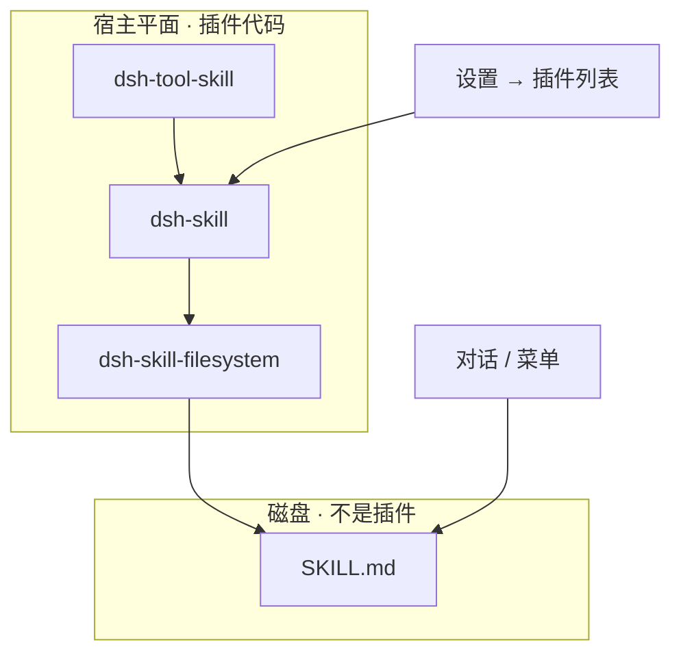

# 课 11 · 插件与技能不是同一层

> [!abstract] 一句话
> 实现技能系统的那几块代码是插件；你放进目录里的每一份技能不是插件，所以设置里不会出现「技能」开关。

> [!question] 这一课要解决的问题
> 作为已经能打开本机网页、读过课 07 或课 10 的学习者：从官方文档与本仓库代码分清「一切皆插件」里的插件、设置页「插件」分区、以及技能（Skill）；说明插件是否已经「包含」技能；作为用户技能放哪、对话里怎么调；作为开发者何时写插件、何时写技能。学完能解释设置页没有技能分区的原因。不写官方 `docs/`，不改装 `agent-loop`。

上一课：[[20260820-11-教程_07-插件是什么与怎么写|课 07 怎么写插件]]（[md](./20260820-11-教程_07-插件是什么与怎么写.md)） · 下一课：[[20260822-16-教程_12-把对话沉淀成能力|课 12 沉淀成能力]]（[md](./20260822-16-教程_12-把对话沉淀成能力.md)） · 回 [[00-README|课程表]]

---

## 图景

三个词听起来像一类东西，产品里却占三层：

| 你听到的词 | 平台真正指的 | 用户在哪碰到 |
|---|---|---|
| 「一切皆插件」 | Cordis 运行时单元：`apply(ctx)` | 设置 → **插件列表**（只读）；开发时写 `cordis.yml` |
| 设置页「插件」分区 | 已挂**宿主平面**且登记了设置卡片的那一小截 | 设置 → **插件 → 插件配置**（出厂常见终端 / Agent 循环 / 网页搜索） |
| **技能** | 可复用的任务说明书 | **不在设置里**。对话打 `/`，或模型调 `skill` 工具 |

> **实现技能系统的代码是插件；磁盘上的 SKILL.md 是这些插件去读的数据。**

这张图要记住：**列表里能看到名叫 skill 的插件行，看不到你写的那些技能文件。**

---

## 步骤

### 1. 打开设置，对上两张标签

Web（默认 `http://127.0.0.1:3080`）→ **设置 → 插件**。

1. **插件配置**：只有向设置系统登记了卡片、且挂在宿主平面的插件。`skill-filesystem` 在 Web 里挂在 **agent preset** 平面，按设计不能在这里出卡片（同一 preset 被第二会话挂上会重复注册）。核对：`packages/client/ui-settings-plugins/README.zh.md`。
2. **插件列表**：`ctx.loader.entries()` 的只读快照，列的是 `cordis.yml` 行（如 `skill`、`tool-skill`），**不读** `~/.dsh/skills/`。核对：`packages/host/plugin-inventory/README.zh.md`。

### 2. 官方怎么定义插件

架构首页：产品每一部分都是 Cordis 插件，包括 agent 循环；扩展方式是再挂一个插件，不是打补丁内核。最小形态见 `docs/user/develop/basic/index.zh.md`：导出 `apply(ctx)`。

相邻词不要混：

- **bundle**：一个 npm 包 + `cordis.patch.yml`（往树上插哪些行）
- **profile**：`$DSH_HOME/profiles/<name>` 的可启动组合
- `dsh plugin add` 装的是 bundle，不是一份 SKILL.md

### 3. 官方怎么定义技能

`docs/subsystems/skills.zh.md`：可复用的、按任务写的 agent 指令。模型默认只看见 **名字 + 描述**；正文要加载后才进上下文。

技能能力本身仍是四个插件：`dsh-skill`（服务）、`dsh-skill-filesystem`（扫盘）、`dsh-tool-skill`（模型工具）、`dsh-client-ui-skill`（`/` 菜单）。

### 4. 用户怎么用技能

往约定一层目录放 `SKILL.md` 或 `<id>.md`（不递归更深）。对话输入框打 `/`，或让模型调 `skill`。不要去设置里找开关。

### 5. 开发者怎么选

需要新工具、新 UI、可替换服务 → **插件**（课 07）。需要可复用工作流说明书 → **技能**（课 12）。

---

## 边界

- 「插件已经包含技能」只对**实现层**成立，对**用户内容层**不成立。
- 本课不教写 `apply(ctx)` 的导出细则，那是课 07。
- 同名多目录谁赢 → 课 14；写完要不要重启 → 课 13。

> [!warning]
> 不要用「设置里搜不到技能」判断产品缺功能。入口在对话，不在设置分区。

---

## 验收

- [ ] 能分开：Cordis 插件、设置卡片、Skill 文件。
- [ ] 能解释插件列表为何能看到 `skill` 行却看不到 SKILL.md。
- [ ] 能说出技能用户入口是 `/` 或 `skill` 工具。
- [ ] 能判断自己下一步该写插件还是写技能。

---

## 下一步

要把这次对话变成以后还能用的能力 → [[20260822-16-教程_12-把对话沉淀成能力|课 12]]（`S-learn-ask` 收口后动手）。

要写一个真正的 Cordis 插件 → 回 [[20260820-11-教程_07-插件是什么与怎么写|课 07]]（`S-eng-deep`）。

---

## 相关与参考

### 内部（本学堂 · 双链）

- 相近主题：[[20260820-11-教程_07-插件是什么与怎么写|课 07 插件怎么写]]
- 平行展开：[[20260820-14-教程_10-核心概念清单与解释|课 10 概念清单]]
- 课程表：[[00-README]]

### 外部（仓内）

- [架构 Everything is a plugin](../../../docs/architecture.zh.md)
- [技能子系统](../../../docs/subsystems/skills.zh.md)
- [技能包 README](../../../packages/skill/README.zh.md)

## 附录 · 原始输入

### 2026-08-22 · 首问

> 接下来，请你帮我创建一个教程。官方给出来的说法是一切皆插件，但是我们在他的界面里面也找不到技能。他所说的插件是不是已经包含了技能呢？从官方的文档里面，它是怎么定义插件这个事情的？从他的代码里面，他所定义的插件又是怎么回事？在这一套工具里面对于插件和技能这个部分从平台方，他是怎么定义的？我们作为一个用户又应该如何理解？就是帮我综合分析。写出一个教程文档来告诉我们，让我理深刻理解这一部分，我非常困惑，就是在他的界面上，为什么没有技能这个事情呢？在这个设置页面里面也没有技能，这个很奇怪。他不停的说插件插件，但是呢，他官方所表达的插件又是怎么回事？就是帮我创建文档，分析之后，创建文档，告知我。
