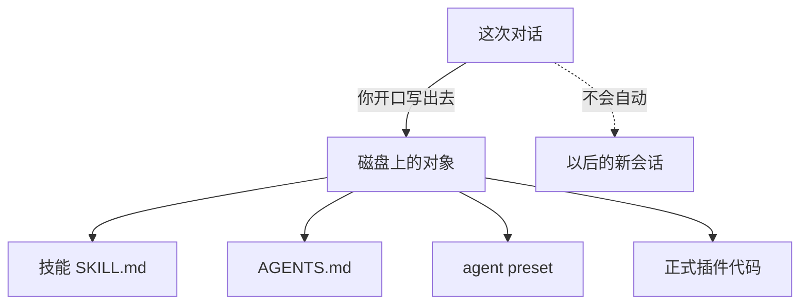

# 课 12 · 把对话沉淀成能力

> [!abstract] 一句话
> 可以让当前会话把做法写出去，但不能指望聊完自动变强；日常默认写成技能，不要一上来写插件。

> [!question] 这一课要解决的问题
> 作为已经分清插件与技能的网页用户：当前对话会不会自动变成以后的能力；若要把有价值的工作流沉淀下来，应选技能、工作区指令、preset 还是插件；在当前会话里如何开口让 Agent 写到磁盘并核对。学完能独立完成一次写技能并在下一轮调用。不改装核心循环，不把动态插件当成跨重启方案。

上一课：[[20260822-15-教程_11-插件与技能不是同一层|课 11]]（[md](./20260822-15-教程_11-插件与技能不是同一层.md)） · 下一课：[[20260822-17-教程_13-技能热加载|课 13]]（[md](./20260822-17-教程_13-技能热加载.md)） · 回 [[00-README|课程表]]

---

## 图景

当前会话只是一份会话日志。新开会话、换工作区之后，模型不会自动把「刚才商量好的流程」当成技能。官方没有「从本对话一键生成插件」的按钮。

正确心态：**把可复用部分从聊天搬到文件。** Agent 擅长搬运，不会在你没要求时私自搬运。



这张图要记住：**对话本身不是能力。**

---

## 步骤

对着刚聊完的东西按顺序停在第一条「是」：

1. **遇到某类任务再照做？** → **技能**（本命容器；目录里只占名字+描述，正文按需加载）。
2. **只要在这个仓库/这台机器干活就得遵守？** → **`AGENTS.md`**（每次自动注入，写短）。路径见 `packages/context/agent-instructions/README.zh.md`。
3. **有时要另一套工具/人设？** → **复制 agent preset**（已开始的会话不能中途换；改的是之后新建的会话）。见课 06。
4. **模型多了一种以前没有的真动作？** → 试运行用创造模式里的动态插件（内存、重启即无）；跨重启走正式插件（课 07）。

都是否：保存这次交付物即可，不必硬做成技能。

### 开口模板（可照抄）

`standard` 即可写技能，不必切创造模式。把三件事说死：**沉淀成哪一种、写到哪、名字叫什么。**

```text
请把我们刚才确认的做法沉淀成技能，不要只在回复里总结。

要求：
- 写成目录包：<项目根>/.dsh/skills/<kebab-name>/SKILL.md
  （全机通用改为 ~/.dsh/skills/<kebab-name>/SKILL.md）
- frontmatter 含 name 与 description；description 写清何时使用
- 正文写成以后可独立执行的步骤；不要写闲聊和试错
- 写完用 read 把文件读回来给我核对
```

核对后**再发一条消息**（或新会话），打 `/kebab-name` 或说「按这个技能做」。同一条旧消息不会倒回去加载新文件。

---

## 边界

- 模型可见 ⟺ 已写入会话日志。压缩可能藏起旧轮次，不写文件连同一会话后半段都可能忘。
- 动态插件不是正式插件草稿的自动升级路径。
- 家目录在工作区沙箱外，第一次写入可能要你批准提权。

> [!tip]
> 让 **当前 DSH 会话**用 `write` 写 `.dsh/skills/`，下一步就能加载（课 13）。用 Cursor 在外面写盘也可以，发下一轮即可，仍不必重启。

---

## 验收

- [ ] 能说出「聊完不会自动变技能」。
- [ ] 能按 A–D 选对容器。
- [ ] 能发出带路径和 name 的沉淀指令，并 read 核对文件存在。
- [ ] 下一轮能 `/name` 或让模型 `skill` 加载。

---

## 下一步

验证不重启能否用上 → [[20260822-17-教程_13-技能热加载|课 13]]。

同名多目录谁生效 → [[20260822-18-教程_14-同名技能优先级|课 14]]。

---

## 相关与参考

### 内部（本学堂 · 双链）

- 相近主题：[[20260822-15-教程_11-插件与技能不是同一层|课 11]]
- 平行展开：[[20260820-10-教程_06-Agent预设与四种模式|课 06 预设]]
- 课程表：[[00-README]]

### 外部（仓内）

- [工作区指令](../../../packages/context/agent-instructions/README.zh.md)
- [动态插件 tool-cordis](../../../packages/extensions/tool-cordis/README.zh.md)

## 附录 · 原始输入

### 2026-08-22 · 首问

> 我作为一个用户，我能不能直接用ai基于我当前的对话，来让他自己把一些实践形成插件呢？如果可以又应该怎么做？如果不可以，那是为什么？就让他自己改良自己，自己给自己增加插件，或者自己给自己增加技能，扩展能力。比如说我跟他聊聊了一些很有价值的问题，或者我们做一些很有价值的工作流，我想把它直接沉淀下来，形成他以后的能力。我应该怎么做，怎么想？用插件，还是用技能，还是用其他什么东西？这个帮我再创建一个教程，帮助我理解并做到。
