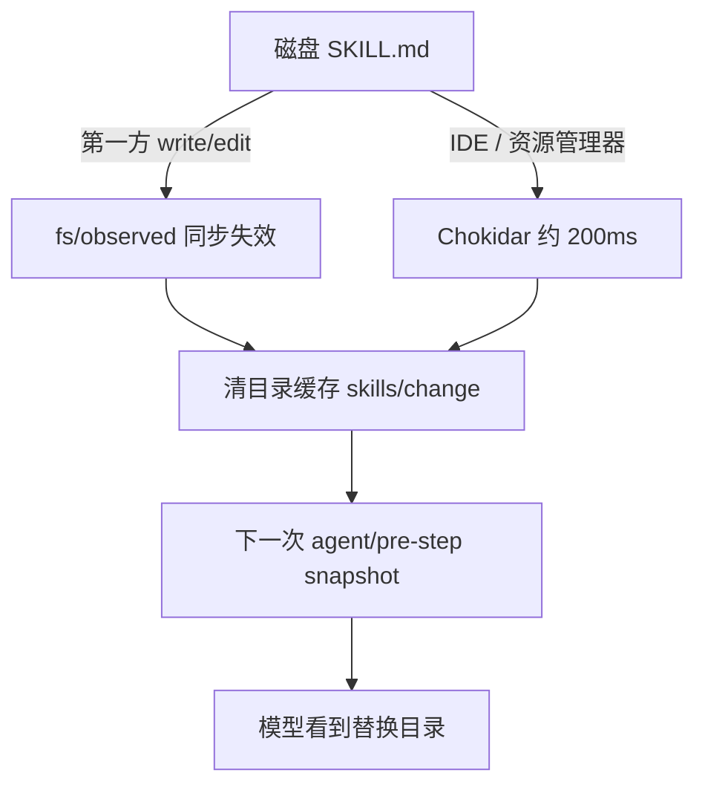

# 课 13 · 新建技能要不要重启

> [!abstract] 一句话
> 本地技能有热加载，不必重启 `dsh`；模型在下一次步骤看到新目录，Web 的 `/` 菜单可能仍缓存旧列表。

> [!question] 这一课要解决的问题
> 作为用本机创建源或让 DSH `write` 在约定目录写下 SKILL.md 的用户：不重启、不重开 Web 时，下一轮对话能否马上用到、模型会否自己认出；分清 Agent 自己写文件与 Cursor/资源管理器写文件两条路径；「写了却看不见」时查哪几件事。以仓库已实现机制为准。

上一课：[[20260822-16-教程_12-把对话沉淀成能力|课 12]]（[md](./20260822-16-教程_12-把对话沉淀成能力.md)） · 下一课：[[20260822-18-教程_14-同名技能优先级|课 14]]（[md](./20260822-18-教程_14-同名技能优先级.md)） · 回 [[00-README|课程表]]

---

## 图景

真源：[`.agents/notes/implemented/feature/2026-07-27-skill-catalog-hot-refresh.zh.md`](../../../.agents/notes/implemented/feature/2026-07-27-skill-catalog-hot-refresh.zh.md)。

| 你以为的 | 实际行为 |
|---|---|
| 要重启 `pnpm dsh web` | **不要。** |
| 文件保存瞬间模型已知 | **还没有。** 目录在 `agent/pre-step` 发布 |
| 下一轮用户消息一定能用 | **发现完成后能。** |
| Web `/` 立刻列出新名字 | **不一定。** 浏览器按会话缓存 `skill.list` |

这张图要记住：**热的是下一步请求，不是编辑器保存事件。**

---

## 步骤

### 两条创建路径

- **路径 A**：当前 DSH 会话用 `write` / `edit`。失效同步。写完后的**下一个模型步骤**即可看见名字并 `skill` 加载。装配快照：`packages/examples/agent-spine-demo/tests/agent-core.spec.ts`（`hot-skill`）。
- **路径 B**：Cursor / 资源管理器 / git。走 Chokidar；已有根约 200ms 稳定窗口；新建根还要从祖先 `watchFile` 跟进。然后仍要等下一次 `pre-step`（你再发一条消息）。

手打 `/kebab-name` 再发送：宿主在 `pre-step` 扫描消息，**即使菜单没列出也能注入正文**。

### 跟着验证（不重启）

1. `dsh web` 已跑，工作区已选，preset 为 `standard`。
2. 写入 `<工作区>/.dsh/skills/hot-local/SKILL.md`，frontmatter 含 `name: hot-local` 与非空 `description`。
3. 等大约半秒（新建目录再多一两秒）。**不要重启。**
4. 原会话发送：请加载 `hot-local` 并按它做。
5. 不要用「只打开 `/`、不发送」当成败证据。

### 热加载救不了的

位置必须是一层 `<根>/<id>/SKILL.md` 或 `<根>/<id>.md`；frontmatter 合法；当前 preset 挂了 `skill-filesystem` + `tool-skill`；`disable-model-invocation: true` 的不会进模型目录。

---

## 边界

- 快照不完整时，面向模型的消费方保住上一份完整目录，**新技能暂时也不会发布**。
- 只改正文、不改 name/description：不重发目录，但下次 `skill()` 读新正文。
- TUI 会消费 `skills/change` 刷新补全；Web 这条事件不在浏览器转发白名单。

> [!warning]
> `/` 菜单没有新名字，不能单独证明热加载坏了。

---

## 验收

- [ ] 能说出不必重启进程。
- [ ] 能分清路径 A 与路径 B 的延迟。
- [ ] 能用下一轮消息或手打 `/name` 验证，而不是只看菜单。
- [ ] 知道放错深层目录时监视当它不存在。

---

## 下一步

同名多目录谁赢 → [[20260822-18-教程_14-同名技能优先级|课 14]]。

---

## 相关与参考

### 内部（本学堂 · 双链）

- 相近主题：[[20260822-16-教程_12-把对话沉淀成能力|课 12]]
- 平行展开：[[20260822-15-教程_11-插件与技能不是同一层|课 11]]
- 课程表：[[00-README]]

### 外部（仓内）

- [热刷新 Agent Note](../../../.agents/notes/implemented/feature/2026-07-27-skill-catalog-hot-refresh.zh.md)
- [skill-filesystem](../../../packages/skill/skill-filesystem/src/index.ts)

## 附录 · 原始输入

### 2026-08-22 · 首问

> 请你帮我基于代码分析一个问题，并写成教程来告诉我：设想这样一种场景，我使用本机的技能创建源技能，然后在恰当的位置上创建了一个技能，他能不能马上就生效，比如我不重启的情况下，在下一轮对话里面就可以直接使用，它，能够自动识别的到，就有点像热加载的特性，现在有没有这个能力？
