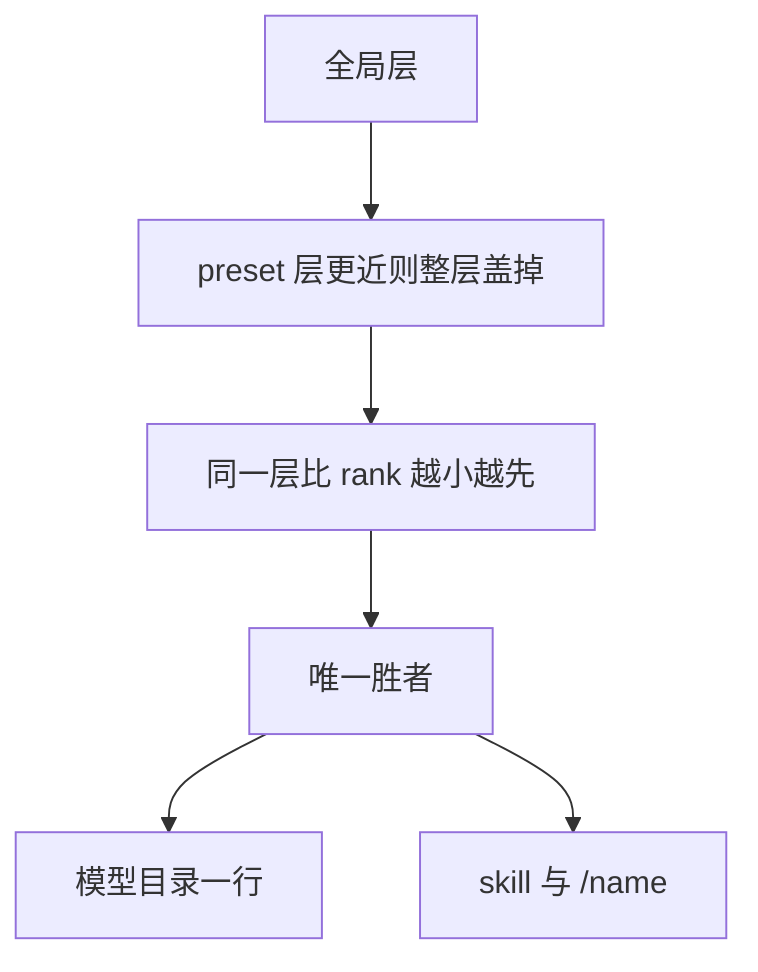

# 课 14 · 同名技能在多个目录里谁生效

> [!abstract] 一句话
> 同名只留一个胜者；近的 scope 层整层盖过远层，同一层里 rank 越小越优先，`source` 字段自己不当优先级。

> [!question] 这一课要解决的问题
> 作为会放技能文件的用户：同一 `name`（技能 id，不是文件夹名）出现在项目目录、用户目录、preset 自带目录时，目录、`skill` 工具、手打 `/名字` 分别加载哪一份；如何确认实际路径。以 `dsh-skill` / `dsh-skill-filesystem` 为准。

上一课：[[20260822-17-教程_13-技能热加载|课 13]]（[md](./20260822-17-教程_13-技能热加载.md)） · 下一课：[[20260822-19-教程_15-让网页理解图片|课 15]]（[md](./20260822-19-教程_15-让网页理解图片.md)） · 回 [[00-README|课程表]]

---

## 图景

技能 id 是 YAML 里的 kebab-case **`name`**。文件夹叫什么无所谓。目录只扫一层，更深路径进不了候选。

这张图要记住：**没有「列出全部同名项再让模型选」。**

---

## 步骤

### 1. 先层后 rank

`collectFresh`：先装全局层，再沿近层覆盖；同名直接换掉。测试钉死：近层 rank 写成 900，远层是 10，**近层仍然赢**。

Web 上 `standard` 看的是全局 ∪ 这个 preset 层。preset 里若有同名，**直接盖掉全局**，不再看文件 rank。

同一层内部：更小的 `rank` → 更早注册的提供方 → 更早出现在 `list()` 的条目。落败打警告，模型看不见。

### 2. 默写本地 rank（越小越优先）

| Rank | source | 路径 |
|---|---|---|
| 100 | project-dsh | `<git根>/.dsh/skills` |
| 200 | project-agents | `<git根>/.agents/skills` |
| 250 | runtime | `ctx.skills.register()` |
| 300 | custom | `customSkillDirs`（如创造模式自带） |
| 400 | user-dsh | `~/.dsh/skills` |
| 500 | user-agents | `~/.agents/skills` |
| 600 | bundled | 随包 |

**项目级盖用户级。** 模型目录只渲染 name + description，不渲染路径。

### 3. 确认用了哪份

加载结果里的「Base directory for this skill」指向胜者文件所在目录。

### 4. 日常对照

- 家里和项目都有同名：打开该工作区时项目赢；换没有项目副本的仓库，家里那份露出来。
- 创造模式自带（300）盖过 `~/.dsh/skills`（400）。要盖过随包说明书，写到项目 `.dsh/skills`。

---

## 边界

- 同 rank 的多个 `customSkillDirs`：数组里写在前面的赢。
- 同一根里 `id/SKILL.md` 与 `id.md` 同 name：按文件系统名排序，不要依赖。
- 命令与技能同名时，命令先吃掉 `/` 那一行。
- 高优先级那份若禁止模型调用，目录里可能看不到名字，手打仍可能打到胜者。

> [!tip]
> 在低优先级目录改同名正文，热加载 digest 可能不变（胜者没变）。

---

## 验收

- [ ] 知道比的是 frontmatter `name`。
- [ ] 能默写 100/200/400/500 谁盖谁。
- [ ] 能用 Base directory 核对路径。
- [ ] 知道三条入口都只解析胜者。

---

## 下一步

要看图 → [[20260822-19-教程_15-让网页理解图片|课 15]]。还在技能目录里迷路 → 回课 11。

---

## 相关与参考

### 内部（本学堂 · 双链）

- 相近主题：[[20260822-17-教程_13-技能热加载|课 13]]
- 平行展开：[[20260822-15-教程_11-插件与技能不是同一层|课 11]]
- 课程表：[[00-README]]

### 外部（仓内）

- [skills 子系统](../../../docs/subsystems/skills.zh.md)
- [dsh-skill](../../../packages/skill/skill/src/index.ts)
- [skill-filesystem](../../../packages/skill/skill-filesystem/src/index.ts)

## 附录 · 原始输入

### 2026-08-22 · 首问

> 帮我再追加另外一种场景同一个技能名称技能id，在多个目录上都存在。那么它的优先级是怎么定义的？它会如何的？触发，请帮我把这个问题分析之后，形成一个新的教程，我想理解这一部分内容。
