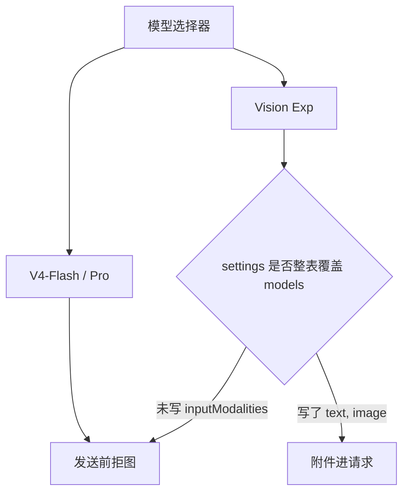

# 课 15 · 让网页理解图片

> [!abstract] 一句话
> 选带 `inputModalities: [text, image]` 的 Vision Exp；自己写了 `llm-deepseek.models` 却漏这个字段时，界面上看着是视觉模型，发送时仍按纯文本拒图。

> [!question] 这一课要解决的问题
> 作为已能打开本机 Web、已有 API Key 的用户：要让 dsh 看见图片须改哪些设置；为何根 README / 用户指南不容易看到这条；自定义网关字段为何和官方插件不同。学完能独立改 `~/.dsh/settings.yaml` 并选对模型发一张图。配置在 `$DSH_HOME`，不进 Git。不把社区外挂视觉插件当官方路径。

上一课：[[20260822-18-教程_14-同名技能优先级|课 14]]（[md](./20260822-18-教程_14-同名技能优先级.md)） · 下一课：[[20260822-20-教程_16-官方近期更新怎么读|课 16]]（[md](./20260822-20-教程_16-官方近期更新怎么读.md)） · 回 [[00-README|课程表]]

---

## 图景

核对：`packages/llm/llm-deepseek/src/index.ts` 的 `DEFAULT_MODELS`；省略 `inputModalities` 视为仅 `text`。官方视觉模型是 **`deepseek-v4-flash-vision-exp`**（提供方 `deepseek-official`）。

这张图要记住：**界面选了 Vision 不等于配置声明了 image。**

---

## 步骤

1. 启动 Web（课 03）。模型选择器选 **DeepSeek-V4-Flash-Vision-Exp**，不要选 Flash/Pro。
2. 打开 `~/.dsh/settings.yaml`。若存在 `llm-deepseek.models` 列表，**每一条**都要写清模态。Vision 那条必须是 `inputModalities: [text, image]`。列表会**整体替换**内置目录（`packages/llm/llm-deepseek/README.zh.md`）。
3. 默认模型可设 `agent-default-model.model: deepseek-v4-flash-vision-exp`。变更下一次请求生效，不必重启服务器（`docs/user/guide/providers.zh.md`）。
4. 输入框附加 png / jpeg / webp / gif。Agent 读磁盘图走 `read_image`，执行时当前路由必须已声明图片输入。
5. 自定义网关走 `llm-pi-ai`，字段是 **`input: [text, image]`**，与 `inputModalities` **不是同一个键**。设置表单没有模态字段，只能改 yaml。

### 为什么手册上不好找

根 README 不提视觉。用户指南排错写官方 chat-completions 纯文本——对 Flash/Pro 成立，**没有指向 Vision Exp**。真源在包 README 和 `DEFAULT_MODELS`。外网检索容易把人带到 ModLens 一类外挂，那不是本仓库官方路径。

近期官方还把图片改成「历史只存规范化附件、请求走 Files / 有界 inline」（课 16）。本课只解决**选对模型并声明模态**。

---

## 边界

- 密钥仍在 `~/.dsh/.credentials.yaml`，不要提交、不要发进对话。
- 16-bit PNG、透明 WebP 等由附件规范化处理，不在本课展开。
- 本机曾出现 Source Control 大量删除：那是 clone 中断，不是线上删文件。

> [!warning]
> 只改 `llm-pi-ai.input` 改不到官方 `llm-deepseek` 段。

---

## 验收

- [ ] 能说出 Flash/Pro 纯文本、Vision Exp 才是官方看图入口。
- [ ] 能检查 `models` 覆盖是否漏了 `inputModalities`。
- [ ] 能分清 `inputModalities` 与 `input`。
- [ ] 知道该先打开包 README，而不是只停在根 README。

---

## 下一步

关心 Files 上传、规范化附件 → [[20260822-20-教程_16-官方近期更新怎么读|课 16]]。

填 Key 卡壳 → [[20260820-09-教程_05-设置页为什么录不了API-Key|课 05]]。

---

## 相关与参考

### 内部（本学堂 · 双链）

- 相近主题：[[20260820-06-教程_04-网页用户旅程与API-Key|课 04]]
- 平行展开：[[20260820-14-教程_10-核心概念清单与解释|课 10]]
- 课程表：[[00-README]]

### 外部（仓内）

- [llm-deepseek README](../../../packages/llm/llm-deepseek/README.zh.md)
- [配置模型](../../../docs/user/guide/providers.zh.md)
- [read_image 工具目录](../../../docs/tool-catalog.zh.md)

## 附录 · 原始输入

### 2026-08-22 · 首问

> 然后回答我一个问题，如何让他能够理解图片，我要做哪些设置？请你帮我设置一下，并形成一个文档。

### 2026-08-22 · 追问 1

> 这一个项目里面是不应该有删那么多文件被删除的标记的，我们一切以线上的项目为准。刚刚最佳实践里面的图片理解配置是从哪里来的？这些信息源从哪里来？在后面标记一下。我要反思一下，我为什么没有看到相应的消息，在这个事情上折腾了一下。
