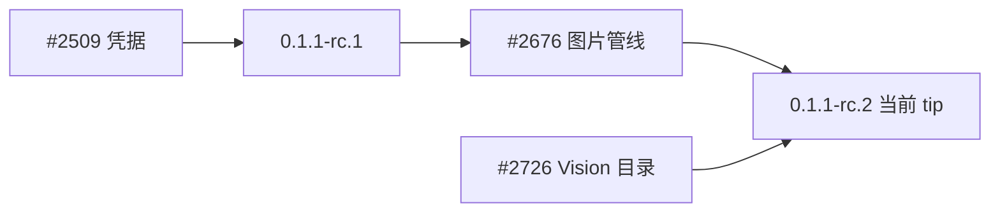

# 课 16 · 官方近期更新怎么读

> [!abstract] 一句话
> 先看图片通路和视觉模型目录，再看凭据/Web；发版号只说明尖端在哪，不代替读机制。

> [!question] 这一课要解决的问题
> 作为同时是用户和开发者的本仓读者：在已能 `fetch` 官方 `master` 的前提下，读懂 2026-08-20～21 合入的变更里哪些有感、哪些是工程内部；如何对照 Vision / Files / 设置覆盖。不把 git 操作当产品主线，不写官方 `docs/`。

上一课：[[20260822-19-教程_15-让网页理解图片|课 15]]（[md](./20260822-19-教程_15-让网页理解图片.md)） · 回 [[00-README|课程表]]

---

## 图景

核对当时尖端：`b150a551b8`，产品版本 `0.1.1-rc.2`（merge #2908）。本机 `master` 跟踪 `upstream/master`（`deepseek-ai/deepseek-harness`）；开发工作在 `dev-creator`。

GitHub 上的 `deepseek-ai/deepseek-harness` 关闭了 PR API，读变更靠 merge 说明、提交主题和已入库 Agent Note。

这张图要记住：**rc.2 相对 rc.1 的用户增量，主要是图片策略。**

---

## 步骤

按优先级读这四块（细节真源：`.agents/notes/implemented/feature/2026-08-20-unified-image-request-pipeline.md`）：

1. **图片通路（#2676）**
   历史只存规范化附件；发给模型的是请求投影。DeepSeek 视觉优先 Files API（`file_id`），解析失败才有界 inline。区域读图工具已去掉。随后：不透明 WebP 缺 alpha 可接受；Files 与流式超时拆开。

2. **视觉模型目录（#2726）**
   默认带上 Vision Exp。你在 yaml **整表覆盖** `models` 且漏 `inputModalities` 时，仍会当成纯文本（课 15）。

3. **凭据 / pi-ai（#2509）**
   向人要密钥，而不是没密钥就把提供方从目录藏掉。自定义网关图片字段仍是 `input`。

4. **Web 体验**
   多行提问、子 Agent 顶栏、重试耗尽后仍显示回合错误、文档站可出 `.md` + `llms.txt`。

工程向（可略）：Windows pnpm、doc-sync、session 快照稳定、权限文案 #2608 被 #2903 撤回。

日常同步官方：在 `master` 上 `git pull`（已跟踪 upstream）。个人改动留在 `dev-creator`，需要时再把 `master` 合并进去。

---

## 边界

- 本课描述的是 **2026-08-21 当晚 tip**。以后 `git pull` 若 SHA 变了，先对 `upstream/master` 再读新 merge。
- 合上游、改核心循环不是本课步骤。
- 分析报告草稿曾写在 `docs/local/`，学堂正文以本课为准。

> [!tip]
> 跑视觉时看 Files 上传 / inline fallback 日志，不要只听模型说「看见了」。

---

## 验收

- [ ] 能说出当前发版号与「先看图片管线」。
- [ ] 能把 Vision 目录和 yaml 覆盖降级连到课 15。
- [ ] 能分开用户有感项与 CI/文档站项。
- [ ] 知道 `master` 跟官方、`dev-creator` 跟个人开发。

---

## 下一步

要看图 → 课 15。要改叠加层 → `S-eng-change`（Areas 里的上游叠加笔记），不在本课改循环。

---

## 相关与参考

### 内部（本学堂 · 双链）

- 相近主题：[[20260822-19-教程_15-让网页理解图片|课 15]]
- 平行展开：[[20260820-14-教程_10-核心概念清单与解释|课 10]]
- 课程表：[[00-README]]

### 外部（仓内）

- [统一图片请求管线 Agent Note](../../../.agents/notes/implemented/feature/2026-08-20-unified-image-request-pipeline.md)
- [Files inline fallback](../../../.agents/notes/implemented/bug-fix/2026-08-21-deepseek-files-inline-fallback.zh.md)

## 附录 · 原始输入

### 2026-08-21 · 首问

> 分析一下相比 dev-creator 有哪一些变动，新增了哪一些能力，修复了哪一些问题、哪一部分对用户来说特别重要的，哪一些是对用户来讲是有感的，请你帮我分析一下，我既是一个用户，也是一个开发者，然后的话我希望。所以我了解他最近的变更。重点关注对我特别有价值的那些部分。创建一个基本的分析报告和教程，让我充分的理解，他最近的更新

### 2026-08-22 · 追问 1

> 刚刚又拉去了，拿一些新的提交，创建一个分析报告，我想关注官方的哪里又做了一些更新？

### 2026-08-22 · 追问 2

> 请你帮我检查当前的代码，是否已经拉起了上游最新的提交，保持和上游最新的一致。
